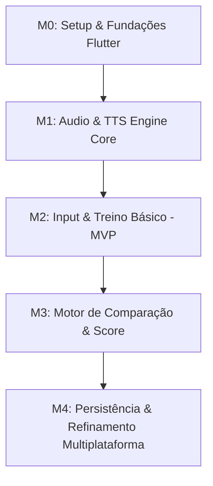

# OpenSpec: Tasks & Work Breakdown Structure (WBS)
**Project:** Multiplatform Pronunciation Trainer (Flutter)  
**Spec Reference:** [pronunciation_trainer_spec.md](pronunciation_trainer_spec.md)  
**Status:** DRAFT (Ready for Execution)  

---

## 1. Visão Geral dos Marcos (Milestones)

- **M0: Setup & Fundações:** Estrutura inicial do projeto Flutter com suporte aos 5 alvos (Android, iOS, Web, Linux, Windows), injeção de dependências e design system.
- **M1: Audio & TTS Engine Core:** Abstração de áudio baseada em `audioplayers`, serviço de gravação `record` e motor de voz neural gratuito (Edge-TTS + fallback).
- **M2: Input & Treino Básico (MVP):** Fluxo central onde o usuário digita uma frase, ouve a referência com controle de velocidade (1.0x / 0.75x) e grava sua voz.
- **M3: Motor de Comparação & Avaliação:** Transcrição da fala, alinhamento de texto (Needleman-Wunsch / Levenshtein), transcrição fonética IPA e exibição colorida palavra a palavra.
- **M4: Persistência & Homologação Multiplataforma:** Armazenamento local de histórico e revisão, tratamento de permissões nativas e validação de build nas 5 plataformas.

---

## 2. Quadro de Tarefas Detalhadas

| ID | Marco | Título | Depende de | Status | Prioridade |
| :--- | :--- | :--- | :--- | :--- | :--- |
| **FLT-001** | M0 | Setup do Workspace Flutter 3.x com 5 Plataformas | — | `todo` | P0 |
| **FLT-002** | M0 | Configuração do Gerenciador de Estado e Injeção (Riverpod) | FLT-001 | `todo` | P0 |
| **FLT-003** | M1 | Interface e Implementação do `AudioPlayerService` (`audioplayers`) | FLT-002 | `todo` | P0 |
| **FLT-004** | M1 | Implementação do Motor de Síntese Neural Gratuito (Edge-TTS) | FLT-002 | `todo` | P0 |
| **FLT-005** | M1 | Implementação do Fallback de Síntese Nativa (`flutter_tts`) | FLT-004 | `todo` | P1 |
| **FLT-006** | M1 | Interface e Implementação do `AudioRecorderService` (`record`) | FLT-002 | `todo` | P0 |
| **FLT-007** | M1 | Configuração de Sessão de Áudio Multiplataforma (`audio_session`) | FLT-003, FLT-006 | `todo` | P0 |
| **FLT-008** | M2 | Tela de Entrada e Validação da Frase de Treino | FLT-002 | `todo` | P0 |
| **FLT-009** | M2 | Tela de Prática: Player de Referência com Controle de Velocidade | FLT-003, FLT-004, FLT-008 | `todo` | P0 |
| **FLT-010** | M2 | Tela de Prática: Gravador de Voz com Feedback de Amplitude (Waveform) | FLT-006, FLT-007, FLT-009 | `todo` | P0 |
| **FLT-011** | M3 | Módulo de Transcrição de Fala (Speech-to-Text Multiplataforma) | FLT-006 | `todo` | P0 |
| **FLT-012** | M3 | Algoritmo de Alinhamento de Texto e Destaque Palavra a Palavra | FLT-011 | `todo` | P0 |
| **FLT-013** | M3 | Mapeador Fonético IPA (Grapheme-to-Phoneme Local) | FLT-008 | `todo` | P1 |
| **FLT-014** | M3 | Tela de Feedback: Score Global e Player Duplo de Comparação | FLT-010, FLT-012, FLT-013 | `todo` | P0 |
| **FLT-015** | M4 | Persistência Local de Histórico e Estatísticas (Isar / Hive) | FLT-014 | `todo` | P1 |
| **FLT-016** | M4 | Permissões e Manifests Nativos (Android, iOS, macOS, Windows, Linux) | FLT-007 | `todo` | P0 |
| **FLT-017** | M4 | Validação e Testes End-to-End nas 5 Plataformas | FLT-015, FLT-016 | `todo` | P1 |

---

## 3. Especificação Atômica das Tarefas

### Marco 0: Setup e Fundações

#### `FLT-001`: Setup do Workspace Flutter 3.x com 5 Plataformas
- **Objetivo:** Inicializar o projeto Flutter habilitando suporte a Android, iOS, Web, Linux e Windows com arquitetura de pastas limpa.
- **Entradas:** Flutter SDK 3.24+.
- **Saídas:** Repositório configurado com pastas `android/`, `ios/`, `web/`, `linux/`, `windows/` e `lib/core/`, `lib/features/`.
- **Critérios de Aceite:**
  - `flutter create --platforms=android,ios,web,linux,windows .` executado com sucesso.
  - `flutter analyze` executa com zero warnings.
  - Tema de cores e tipografia base configurados em `lib/core/theme/`.

#### `FLT-002`: Configuração do Gerenciador de Estado e Injeção (Riverpod)
- **Objetivo:** Estabelecer a infraestrutura de injeção de dependência e fluxo unidirecional de dados.
- **Entradas:** `flutter_riverpod`, `riverpod_annotation`.
- **Saídas:** Providers globais e container de injeção desacoplado da interface gráfica.
- **Critérios de Aceite:**
  - Providers básicos para configurações do usuário, estado do player e histórico de frases registrados e testados.

---

### Marco 1: Audio & TTS Engine Core

#### `FLT-003`: Interface e Implementação do `AudioPlayerService` (`audioplayers`)
- **Objetivo:** Implementar o contrato de reprodução desacoplado baseado no pacote `audioplayers`.
- **Entradas:** Dependência `audioplayers: ^6.1.0`.
- **Saídas:**
  - Interface abstrata `lib/core/audio/audio_player_service.dart`.
  - Implementação `AudioplayersServiceImpl.dart` com métodos: `playBytes()`, `playFile()`, `pause()`, `resume()`, `stop()`, `setPlaybackRate(double rate)`.
  - Streams reativos de posição e estado (`PlayerState`).
- **Critérios de Aceite:**
  - Reprodução de áudio em memória (`Uint8List`) e arquivo local validada.
  - Alteração de velocidade (0.75x e 1.0x) executando sem falhas de decodificação.

#### `FLT-004`: Implementação do Motor de Síntese Neural Gratuito (Edge-TTS)
- **Objetivo:** Criar cliente de síntese de voz neural via protocolo WebSocket do Edge-TTS sem custos ou chaves de API.
- **Entradas:** `web_socket_channel`, protocolo aberto Edge-TTS.
- **Saídas:** `lib/core/tts/edge_tts_service.dart`.
- **Critérios de Aceite:**
  - Conexão WebSocket com `wss://speech.platform.bing.com/consumer/speech/synthesize/readaheadedge/v1`.
  - Envio de payload SSML com texto e voz selecionada (ex.: `en-US-JennyNeural` ou `en-US-GuyNeural`).
  - Recepção do stream de áudio binário MP3 e montagem do buffer completo.
  - Retorno do buffer de áudio em menos de 1 segundo para frases médias (10 a 20 palavras).

#### `FLT-005`: Implementação do Fallback de Síntese Nativa (`flutter_tts`)
- **Objetivo:** Prover síntese offline quando o dispositivo estiver sem internet ou o WebSocket falhar.
- **Entradas:** Dependência `flutter_tts: ^4.1.0`.
- **Saídas:** `lib/core/tts/native_tts_fallback.dart`.
- **Critérios de Aceite:**
  - Fallback automático ativado se o `EdgeTtsService` falhar ou expirar timeout de 2 segundos.
  - Reprodução funcional mesmo com modo avião ativado.

#### `FLT-006`: Interface e Implementação do `AudioRecorderService` (`record`)
- **Objetivo:** Implementar captura de áudio do microfone com gravação PCM/WAV e stream de volume.
- **Entradas:** Dependência `record: ^5.1.2`.
- **Saídas:** `lib/core/audio/audio_recorder_service.dart`.
- **Critérios de Aceite:**
  - Gravação gerada em formato WAV 16kHz Mono.
  - Emissão contínua de amplitude (`getAmplitude()`) para alimentar a visualização de ondas (Waveform).
  - Cancelamento e interrupção seguros com limpeza de buffers temporários.

#### `FLT-007`: Configuração de Sessão de Áudio Multiplataforma (`audio_session`)
- **Objetivo:** Evitar conflito de hardware entre alto-falante e microfone, especialmente no iOS e Android.
- **Entradas:** `audio_session: ^0.1.21`.
- **Saídas:** `lib/core/audio/audio_session_manager.dart`.
- **Critérios de Aceite:**
  - No iOS, ativação de `AVAudioSessionCategoryPlayAndRecord` com opção `defaultToSpeaker`.
  - Sem distorção ou atenuação no volume da voz de referência após usar o microfone.

---

### Marco 2: Input & Treino Básico (MVP)

#### `FLT-008`: Tela de Entrada e Validação da Frase de Treino
- **Objetivo:** Permitir ao usuário digitar livremente uma frase que queira praticar ou selecionar uma sugestão.
- **Entradas:** Mockups visuais e regras de normalização de texto.
- **Saídas:** `lib/features/phrase_input/presentation/phrase_input_screen.dart`.
- **Critérios de Aceite:**
  - Validação de entrada: limite mínimo de 2 palavras e máximo de 40 palavras.
  - Botão de envio rápido para iniciar o treino.
  - Chips com frases recentes sugeridas para clique rápido.

#### `FLT-009`: Tela de Prática: Player de Referência com Controle de Velocidade
- **Objetivo:** Exibir a frase em destaque e permitir ouvir a voz modelo em velocidade normal (1.0x) ou lenta (0.75x).
- **Entradas:** `FLT-003`, `FLT-004`.
- **Saídas:** `lib/features/training/presentation/widgets/reference_audio_card.dart`.
- **Critérios de Aceite:**
  - Botão "Ouvir Frase" sintetiza e toca o áudio instantaneamente.
  - Chip alternador `1.0x` / `0.75x` atualiza o pitch e velocidade do player sem reinicializar o buffer.
  - Feedback visual de loading enquanto o áudio é preparado.

#### `FLT-010`: Tela de Prática: Gravador de Voz com Feedback de Amplitude (Waveform)
- **Objetivo:** Componente interativo com botão de gravação e animação de ondas sonoras em tempo real.
- **Entradas:** `FLT-006`.
- **Saídas:** `lib/features/training/presentation/widgets/recording_control.dart`, `waveform_visualizer.dart`.
- **Critérios de Aceite:**
  - Pressionar para gravar ou clique para alternar grava o áudio do usuário.
  - O gráfico de onda reage à voz do usuário (amplitude de 0 a 1).
  - Limite máximo de segurança de 30 segundos por gravação com encerramento automático.

---

### Marco 3: Motor de Comparação & Score

#### `FLT-011`: Módulo de Transcrição de Fala (Speech-to-Text Multiplataforma)
- **Objetivo:** Converter o áudio do usuário em texto correspondente para comparação.
- **Entradas:** `speech_to_text: ^6.6.0` (Mobile/Web) e adaptadores para desktop.
- **Saídas:** `lib/core/speech_recognition/stt_service.dart`.
- **Critérios de Aceite:**
  - Transcrição precisa do que foi dito pelo usuário em inglês (`en-US` ou `en-GB`).
  - Retorno de hipótese com pontuação de confiança por palavra quando suportado pela plataforma.

#### `FLT-012`: Algoritmo de Alinhamento de Texto e Destaque Palavra a Palavra
- **Objetivo:** Alinhar as palavras da frase modelo com o texto dito e classificar cada palavra em cores.
- **Entradas:** Frase original e transcrição da fala do usuário.
- **Saídas:** `lib/features/evaluation/domain/usecases/align_words_usecase.dart`.
- **Critérios de Aceite:**
  - Algoritmo de distância e alinhamento insensível a pontuação e caixa alta/baixa.
  - Saída estruturada contendo:
    - `word`: Palavra original.
    - `status`: `mastered` (Verde), `near` (Amarelo) ou `needs_work` (Vermelho).
    - `score`: Percentual de acurácia da palavra.

#### `FLT-013`: Mapeador Fonético IPA (Grapheme-to-Phoneme Local)
- **Objetivo:** Exibir a transcrição fonética internacional (IPA) da frase digitada.
- **Entradas:** Tabela / Dicionário fonético CMU embutido em SQLite/JSON local.
- **Saídas:** `lib/core/phonetics/g2p_service.dart`.
- **Critérios de Aceite:**
  - Converte palavras comuns em inglês para símbolos fonéticos padrão (ex.: *thought* -> `/θɔːt/`, *water* -> `/ˈwɔːtər/`).
  - Destaque fonético para ajudar o usuário a corrigir a posição dos articuladores.

#### `FLT-014`: Tela de Feedback: Score Global e Player Duplo de Comparação
- **Objetivo:** Tela completa de resultado após o treino da frase.
- **Entradas:** `ComparisonResult`, arquivo gravado pelo usuário e áudio modelo.
- **Saídas:** `lib/features/evaluation/presentation/feedback_screen.dart`.
- **Critérios de Aceite:**
  - Indicador circular com score global de 0 a 100%.
  - Frase renderizada com badges coloridos em cada palavra.
  - Dois botões de áudio dedicados:
    1. "Ouvir Pronúncia Correta" (toca a voz modelo).
    2. "Ouvir Como Você Falou" (toca o áudio recém-gravado pelo usuário).
  - Botão "Tentar Novamente" e "Nova Frase".

---

### Marco 4: Persistência & Homologação Multiplataforma

#### `FLT-015`: Persistência Local de Histórico e Estatísticas (Hive / Isar)
- **Objetivo:** Armazenar frases praticadas, scores, data e palavras fracas sem necessidade de backend externo.
- **Entradas:** `hive_flutter: ^1.1.0`.
- **Saídas:** `lib/features/history/data/datasources/history_local_datasource.dart`.
- **Critérios de Aceite:**
  - Salva tentativas com timestamp, frase, score e lista de palavras com erro.
  - Carregamento instantâneo do histórico ao abrir o app.

#### `FLT-016`: Permissões e Manifests Nativos (Android, iOS, macOS, Windows, Linux)
- **Objetivo:** Configurar as declarações de sistema para acesso ao microfone e rede em todas as 5 plataformas.
- **Saídas:**
  - `android/app/src/main/AndroidManifest.xml`: `RECORD_AUDIO`, `INTERNET`.
  - `ios/Runner/Info.plist`: `NSMicrophoneUsageDescription`.
  - `windows/runner/Runner.rc` e Capabilities de microfone.
  - `linux/my_application.cc` e pacotes GStreamer documentados.
  - `web/index.html` e headers para suporte a microfone.
- **Critérios de Aceite:**
  - Pedido de permissão nativo exibido corretamente na primeira execução em cada sistema.

#### `FLT-017`: Validação e Testes End-to-End nas 5 Plataformas
- **Objetivo:** Garantir a paridade funcional e compilação limpa em todos os alvos.
- **Critérios de Aceite:**
  - Build Android APK gerado e testado.
  - Build iOS IPA ou simulação funcional.
  - Build Web (`flutter build web`) com áudio operando.
  - Build Linux desktop executando sem dependências quebradas.
  - Build Windows desktop executando sem falhas de áudio.
