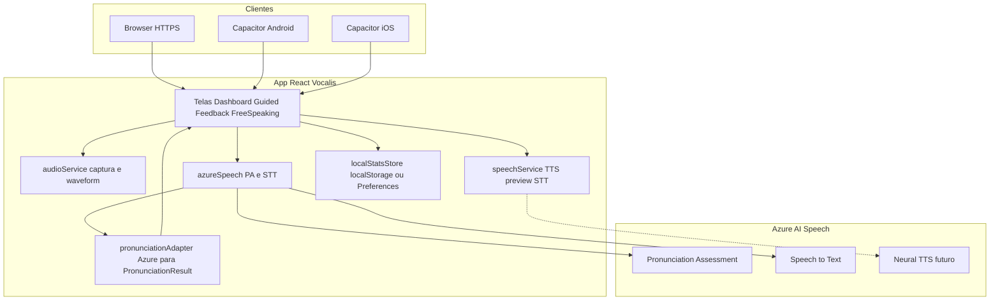
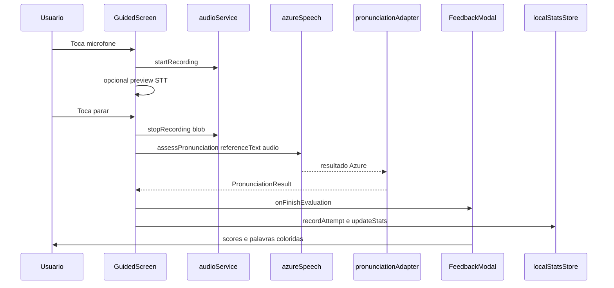
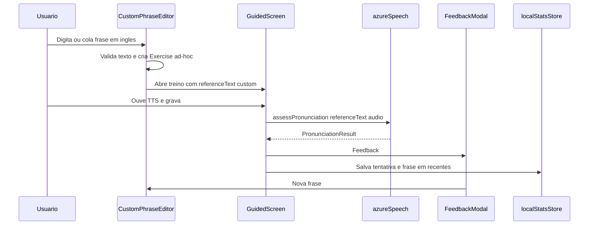

# RFC-001 — Arquitetura do MVP Vocalis AI

| Campo | Valor |
|-------|-------|
| Status | Proposed → Accepted com o PRD/ADRs |
| Data | 2026-09-24 |
| Autor | Projeto Vocalis AI |
| Relacionados | [PRD](../PRD.md), [ADR-001](../adr/001-platform-web-and-mobile.md), [ADR-002](../adr/002-azure-pronunciation-assessment.md) |

---

## 1. Resumo

Este RFC define a arquitetura técnica do MVP pessoal do Vocalis AI:

- **Cliente único** React + Vite, entregue na Web e via **Capacitor** (Android/iOS).
- **Avaliação de pronúncia** via **Azure Speech Pronunciation Assessment** no cliente.
- **Frases do catálogo e frase própria** digitada pelo usuário (mesmo pipeline de score).
- **Sem backend próprio**; persistência apenas local.
- Evolução incremental a partir do mock em `src/`, preservando contratos de UI.

## 2. Motivação

O mock já valida UX, mas o score Levenshtein + Web Speech não entrega valor pedagógico real. Precisamos de um desenho claro para:

1. Trocar o motor de score sem reescrever as telas.
2. Rodar no celular sem fork do código.
3. Guardar progresso local (streak, erros) para fechar o loop de prática.
4. Deixar explícito o que fica para depois (LLM, proxy de API key, stores).

## 3. Arquitetura alvo



### Princípios

1. **UI não conhece Azure** — só consome `PronunciationResult`.
2. **Um adapter** concentra limiares de status (`mastered` / `near` / `needs_work`).
3. **Captura de áudio** permanece em `audioService` para waveform; o SDK Azure pode usar stream próprio ou o blob resultante — a implementação M1 escolhe o caminho mais simples suportado pelo SDK JS, sem mudar o contrato da tela.
4. **Sem inventar transcript**: se a avaliação falhar, mostrar erro; nunca pontuar a frase alvo como se o usuário tivesse falado.

## 4. Contratos de dados

### 4.1 Já existentes (manter)

Tipos em `src/types/index.ts`:

- `Exercise` — frase, IPA, dificuldade, `keyPhonemes`, tip, accent.
- `WordEvaluation` — word, spokenWord, status, ipa, tip, score.
- `PronunciationResult` — overall + submétricas + words + feedbackSummary.
- `UserStats` — streak, sentencesToday, accuracyAvg, practiceMinutes, reviewWord/Phoneme.
- `ConversationMessage` — chat do free speaking.

### 4.2 Extensões recomendadas (M1/M3)

```ts
// Extensões sugeridas — não quebram a UI atual
interface PronunciationResult {
  // ...campos atuais
  prosodyScore?: number;
  provider: 'azure' | 'fallback';
  rawWordCount?: number;
}

interface AttemptRecord {
  exerciseId: string;
  timestamp: number;
  overallScore: number;
  weakWords: string[];   // status needs_work
  weakPhonemes: string[]; // derivado de keyPhonemes do exercício + erros
}

interface LocalProgress {
  stats: UserStats;
  attempts: AttemptRecord[]; // cap. últimos N (ex.: 200)
  lastPracticeDate: string;  // YYYY-MM-DD para streak
  customPhrases: string[];   // frases próprias recentes (ex.: máx. 20, mais nova primeiro)
}
```

### 4.3 Limiares de status (adapter)

| AccuracyScore da palavra (0–100) | `WordStatus` |
|----------------------------------|--------------|
| ≥ 85 | `mastered` |
| ≥ 60 e < 85 | `near` |
| < 60 ou omissão/inserção relevante | `needs_work` |

Limiares ajustáveis em constante única (`SCORE_THRESHOLDS`) para calibração sem caçar magic numbers na UI.

## 5. Fluxos

### 5.1 Repetição Guiada (caminho feliz)



### 5.2 Feedback e retry

- **Tentar novamente:** limpa resultado, permanece no mesmo `exerciseIndex` (ou na mesma frase própria).
- **Próxima frase (catálogo):** incrementa índice circular no catálogo; persiste progresso do dia.
- **Nova frase (modo frase livre):** volta ao editor de texto; não avança o catálogo.

### 5.3 Frase livre (frase própria)



Regras:

- `referenceText` enviado ao Azure é exatamente o texto digitado (trim).
- IPA/tip por palavra: lookup em `ipaDictionary`; senão tip genérico.
- Persistir até N frases recentes (ex.: 20) em `LocalProgress.customPhrases`.
- Conta para `sentencesToday` / streak como qualquer outra tentativa.

### 5.4 Dashboard / revisão

- Ao abrir, lê `LocalProgress`.
- Card de revisão: fonema/palavra mais frequente em `weakPhonemes` / `weakWords` das últimas tentativas.
- CTA “Treinar” abre Guided (idealmente filtrando exercícios com aquele fonema — M3; no M1 pode só deep-link genérico).
- CTA “Treinar minha frase” abre o editor de frase própria.

### 5.5 Free speaking (v1.1)

1. Usuário grava → STT (Azure preferencial).
2. Mensagem do usuário entra no chat **somente** com transcript real (sem placeholder da frase de café).
3. Motor de diálogo: árvore/scripts por tópico (`data/dialogues/coffee-nyc.ts`).
4. TTS da resposta da Emma via `speechService` (upgrade Neural depois).
5. Sugestões estáticas ou por regras simples (keywords).

LLM fica fora deste RFC de MVP.

## 6. Estrutura de pastas futura

```
src/
  components/          # (existente) UI
    custom-phrase/     # NOVO — editor de frase própria (M1)
  data/
    exercises.ts       # catálogo guiado
    dialogues/         # scripts free speaking (M4)
  services/
    audioService.ts    # captura / waveform
    speechService.ts   # TTS browser; STT preview
    azureSpeech.ts     # NOVO — config SDK, PA, STT
    pronunciationAdapter.ts  # NOVO — Azure → PronunciationResult
    pronunciationScorer.ts   # deprecar / fallback off
  storage/
    localStatsStore.ts # NOVO — persistência (stats + customPhrases)
  types/
    index.ts
  App.tsx
```

Variáveis de ambiente (exemplo):

```
VITE_AZURE_SPEECH_KEY=...
VITE_AZURE_SPEECH_REGION=eastus
```

## 7. Persistência local

| Chave | Conteúdo |
|-------|----------|
| `vocalis.progress.v1` | `LocalProgress` JSON |

Regras de streak:

- Se `lastPracticeDate` é ontem e há prática hoje → `streakDays + 1`.
- Se último dia < ontem → reset para 1 no dia da nova prática.
- `sentencesToday` zera quando a data muda.

Capacitor: começar com `localStorage`; se inconsistente no WebView, migrar para `@capacitor/preferences` com a mesma interface `localStatsStore`.

## 8. Segurança e privacidade

| Tema | Política MVP |
|------|----------------|
| Áudio | Enviado apenas ao endpoint Azure Speech da região configurada |
| Logs | Não logar key; não persistir áudio bruto no MVP |
| Segredo | `.env` local + `.gitignore`; rotação se vazar |
| Distribuição | Uso pessoal; não publicar build com key embutida para terceiros |
| Pós-MVP | Proxy serverless que guarda a key no servidor |

## 9. Custos e cotas (ordem de grandeza)

- Cobrança Azure Speech tipicamente por hora de áudio processado (verificar preço atual da região).
- Sessão pessoal: 20 frases curtas/dia ≈ poucos minutos de áudio → custo baixo no free tier / pay-as-you-go inicial.
- Mitigações: limitar duração máxima de gravação (ex.: 15–20 s), desabilitar PA no free speaking no MVP.

## 10. Critérios de aceite técnicos

1. `GuidedScreen` obtém `PronunciationResult` com `provider: 'azure'` no caminho feliz.
2. Adapter cobre omissão de palavras e preenche `spokenWord` / status coerentes.
3. Removido o fallback `liveTranscript || exercise.sentence` do caminho de score.
4. `localStatsStore` sobrevive a reload (web) e a frio-start do app Capacitor.
6. Build: `vite build` + `cap sync` gera Android debuggable com mic permission.
7. Falha de rede/key: UI mostra erro e não abre Feedback com score falso.
8. Frase própria: texto digitado vira `referenceText` Azure; Feedback e “Nova frase” funcionam sem tocar no índice do catálogo.

## 11. Plano de migração a partir do mock

Ordem sugerida (implementação futura; fora deste entregável de docs):

| Passo | Ação |
|-------|------|
| 1 | Criar conta Azure Speech, região, key em `.env` |
| 2 | Adicionar dependency `microsoft-cognitiveservices-speech-sdk` |
| 3 | Implementar `azureSpeech.assessPronunciation(...)` |
| 4 | Implementar `pronunciationAdapter` + testes unitários dos limiares |
| 5 | Ligar `GuidedScreen` ao Azure; remover score Levenshtein do happy path |
| 6 | Editor de frase própria + `Exercise` ad-hoc + atalho no Dashboard |
| 7 | Implementar `localStatsStore` (stats + `customPhrases`) e plugar em `App.tsx` |
| 8 | Inicializar Capacitor; permissões mic; validar em dispositivo |
| 9 | Endurecer FreeSpeaking (sem texto fake; scripts) |
| 10 | (Opcional) Azure Neural TTS; prosody no modal |

## 12. Não-objetivos deste RFC

- Desenho de backend, auth, sync multi-device.
- Escolha definitiva de store listing / branding legal.
- Benchmark formal Azure vs Whisper (pode ser RFC futuro se o custo/qualidade decepcionar).

## 13. Abertos menores (resolvidos por default)

| Questão | Default deste RFC |
|---------|-------------------|
| Granularity Phoneme vs Word | Começar com **Phoneme**; se latência > meta, cair para Word sem mudar UI |
| Preview STT ao vivo no Guided | Manter Web Speech só como UX; **não** entra no score |
| Nome do usuário no Dashboard | String local configurável; default genérico (“Olá!”) em vez de “Carlos!” hardcoded |
| Frase própria sem IPA | Permitido; tips genéricos; score Azure não depende de IPA local |

## 14. Conclusão

A arquitetura proposta transforma o mock em MVP utilizável de verdade: **mesmo React**, **score Azure**, **frase própria + catálogo**, **mobile via Capacitor**, **progresso local**. É a menor distância entre o código atual e o valor prometido no PRD.
