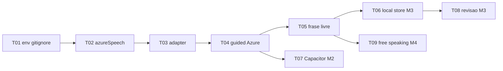

# Tasks — Vocalis AI (para execução por agentes)

Backlog derivado do [PRD](../PRD.md), [ADR-001](../adr/001-platform-web-and-mobile.md), [ADR-002](../adr/002-azure-pronunciation-assessment.md) e [RFC-001](../rfc/001-mvp-architecture.md).

## Como outro modelo deve executar

1. Pegue **uma** task com status `todo` cuja dependência esteja `done`.
2. Leia o arquivo da task por completo + docs citados em **Context**.
3. Implemente **só** o escopo da task (não antecipar M2/M3/M4).
4. Ao terminar, marque o status no topo do arquivo da task para `done` e atualize esta tabela.
5. Não commite `.env` nem keys Azure.

Prompt sugerido para o agente:

```text
Execute a task docs/tasks/m1/T01-....md do projeto Vocalis AI.
Siga o escopo, arquivos e critérios de aceite. Não faça trabalho fora da task.
Ao terminar, marque status: done no arquivo da task e atualize docs/tasks/README.md.
```

## Ordem recomendada



## Board

| ID | Marco | Task | Status | Depende de |
|----|-------|------|--------|------------|
| [T01](m1/T01-env-and-gitignore.md) | M1 | `.env.example` + `.gitignore` + tipos `provider` | done | — |
| [T02](m1/T02-azure-speech-service.md) | M1 | Serviço `azureSpeech.ts` (PA scripted, sem Prosody) | done | T01 |
| [T03](m1/T03-pronunciation-adapter.md) | M1 | Adapter Azure → `PronunciationResult` | done | T02 |
| [T04](m1/T04-guided-use-azure.md) | M1 | Guided usa Azure; remove fallback falso | done | T03 |
| [T05](m1/T05-custom-phrase.md) | M1 | UI “Treinar minha frase” + Exercise ad-hoc | done | T04 |
| [T06](m3/T06-local-stats-store.md) | M3 | Persistência local streak/attempts/customPhrases | done | T04 |
| [T07](m2/T07-capacitor-android.md) | M2 | Capacitor + permissão mic Android | done | T04 |
| [T08](m3/T08-review-card-real.md) | M3 | Card de revisão com dados reais | done | T06 |
| [T09](m4/T09-free-speaking-scripts.md) | M4 | Free speaking sem texto fake + scripts | done | T05 |

## Regras globais

- Stack: React 18 + Vite + TypeScript + Tailwind (já no repo).
- Score: só Azure PA no caminho feliz (ADR-002). **Prosody desligado** no MVP (custo).
- Sem backend. Sem auth.
- UI em português; frases de treino em inglês.
- Preferir F0 free tier Azure (recurso Speech direto, não Foundry).

## M0 (já feito)

Documentação em `docs/` — não reabrir salvo correção pedida pelo usuário.
